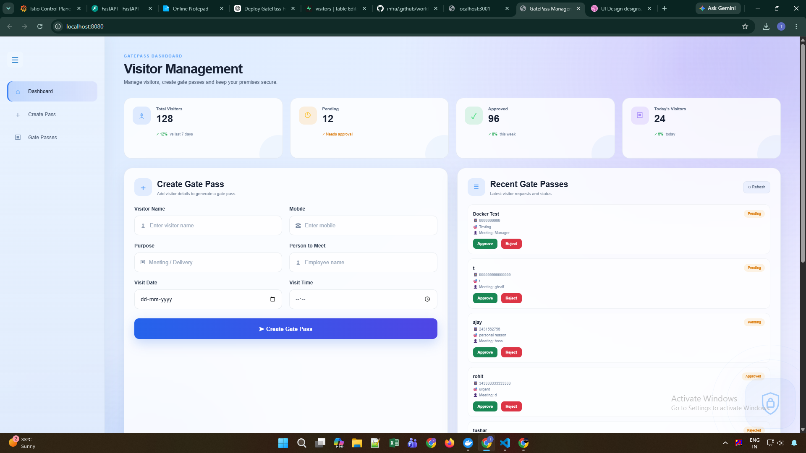
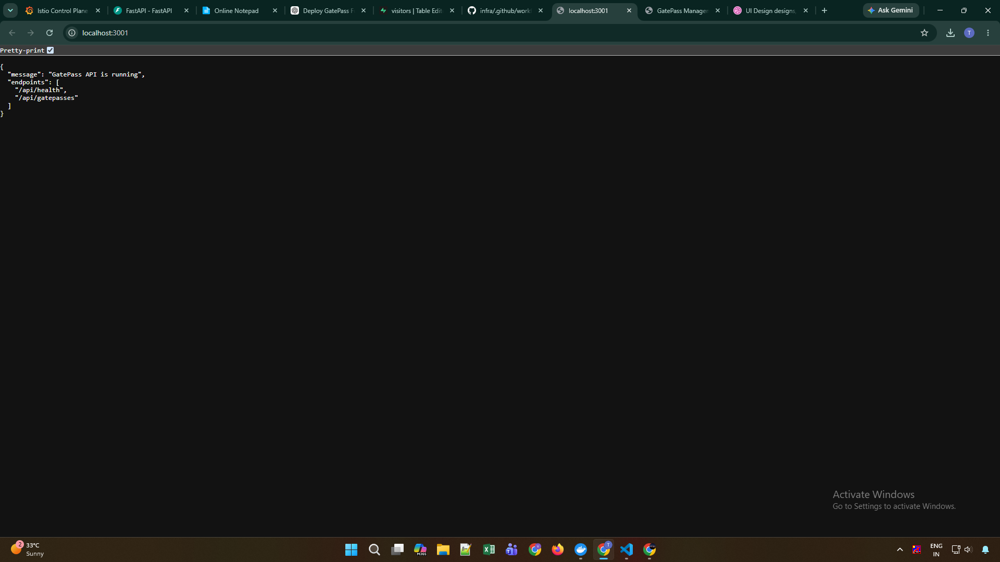

# GatePass Management System — Deployment Practice

Simple full-stack project for practicing:
- Frontend: HTML + CSS + JavaScript → Vercel
- Backend: Node.js + Express → Render
- Database: Supabase PostgreSQL

## Project structure

gatepass-deployment-practice/
├── frontend/
|   |--docker
│   ├── index.html
│   ├── style.css
│   └── app.js
├── backend/
│   ├── server.js
|   |--docker
│   ├── package.json
│   ├── .env
│   └── .gitignore
└── supabase/
    └── schema.sql

## Local setup

### 1. Create Supabase database
Open Supabase SQL Editor and run `supabase/schema.sql`.

### 2. Backend
Open a terminal in `backend`:

```bash
npm install
```

Create `.env` from `.env.example`:

```env
PORT=3001
SUPABASE_URL=your_supabase_project_url
SUPABASE_KEY=your_supabase_anon_or_publishable_key
```

Then:

```bash
npm start
```

Backend runs at:
http://localhost:3001

Test:
http://localhost:3001/api/health

### 3. Frontend
In `frontend/app.js`, set:

```js
const API_URL = "http://localhost:3001/api";
```

Open `frontend/index.html` in a browser.


## docker set up
 FRONTEND
 Build the image:

docker build -t gatepass-frontend 

docker run -d --name gatepass-frontend -p 3002:80 gatepass-frontend
docker logs gatepass-frontend


BACKEND
 Build the image:

docker build -t gatepass-backend .
 
 docker run -d --name gatepass-backend -p 5001:5000 --env-file .env gatepass-backend
docker logs gatepass-backend

Therefore test:
http://localhost:5001/api/health


Stop frontend:

docker stop gatepass-frontend

Stop backend:

docker stop gatepass-backend

# 📧 EmailJS — GatePass Email Notification

EmailJS is used to send an email notification to the manager when a new Gate Pass is created.

---

# 1. Create an EmailJS Account

Go to:

https://www.emailjs.com/

Create an account and log in.

---

# 2. Create an Email Service

From the EmailJS dashboard:

```text
Email Services
    ↓
Add New Service
```

Select your email provider, for example:

```text
Gmail
```

Connect the Gmail account that will be used to send the notification.

After creating the service, you will receive a:

```text
Service ID
```

---

# 3. Create an Email Template

Go to:

```text
Email Templates
    ↓
Create New Template
```

Create a template for the GatePass notification.

Example template:

```text
Subject:
New Gate Pass Created

Hello Manager,

A new gate pass has been created.

Visitor Name: {{visitor_name}}
Mobile: {{mobile}}
Purpose: {{purpose}}
Person to Meet: {{person_to_meet}}
Visit Date: {{visit_date}}
Visit Time: {{visit_time}}

Please review the gate pass.

Regards,
GatePass Management System
```

---

# 4. Template Variables

The variable names in the EmailJS template must exactly match the variable names sent from JavaScript.

Use:

```text
{{visitor_name}}
{{mobile}}
{{purpose}}
{{person_to_meet}}
{{visit_date}}
{{visit_time}}
```

### Variable Mapping

| EmailJS Variable | Form Field     |
| ---------------- | -------------- |
| `visitor_name`   | Visitor Name   |
| `mobile`         | Mobile         |
| `purpose`        | Purpose        |
| `person_to_meet` | Person to Meet |
| `visit_date`     | Visit Date     |
| `visit_time`     | Visit Time     |

---

# 5. Get Template ID

After creating the template, copy the:

```text
Template ID
```

Example:

```text
template_xxxxxxx
```

You will need:

```text
Public Key
Service ID
Template ID
```

---

# 6. Get Public Key

Go to:

```text
Account
    ↓
General
```

Find:

```text
Public Key
```

The EmailJS **Public Key is intended to be used in frontend applications**.

Do not expose private/secret credentials.

---

# 7. Add EmailJS CDN

Open your HTML file.

Before your own JavaScript file, add:

```html
<script src="https://cdn.jsdelivr.net/npm/@emailjs/browser@4/dist/email.min.js"></script>
<script src="js/app.js"></script>
```

### Important

EmailJS must be loaded **before** `app.js`.

Correct:

```html
<script src="https://cdn.jsdelivr.net/npm/@emailjs/browser@4/dist/email.min.js"></script>
<script src="js/app.js"></script>
```

Incorrect:

```html
<script src="js/app.js"></script>
<script src="https://cdn.jsdelivr.net/npm/@emailjs/browser@4/dist/email.min.js"></script>
```

---

# 8. Initialize EmailJS

At the beginning of your JavaScript:

```javascript
emailjs.init({
  publicKey: "YOUR_PUBLIC_KEY"
});
```

Replace:

```text
YOUR_PUBLIC_KEY
```

with your EmailJS Public Key.

Example:

```javascript
emailjs.init({
  publicKey: "xxxxxxxxxxxx"
});
```

---

# 9. GatePass Form IDs

The Create Pass form uses these IDs:

```text
gatepassForm
visitor_name
mobile
purpose
person_to_meet
visit_date
visit_time
message
```

Example:

```html
<form id="gatepassForm">

    <input id="visitor_name">
    <input id="mobile">
    <input id="purpose">
    <input id="person_to_meet">

    <input type="date" id="visit_date">
    <input type="time" id="visit_time">

    <button type="submit">
        Create Gate Pass
    </button>

    <p id="message"></p>

</form>
```

---

# 10. Send Email Using EmailJS

Example JavaScript:

```javascript
emailjs.init({
  publicKey: "YOUR_PUBLIC_KEY"
});

const gatepassForm = document.getElementById("gatepassForm");

gatepassForm.addEventListener("submit", async (e) => {
  e.preventDefault();

  const visitorName =
    document.getElementById("visitor_name").value;

  const mobile =
    document.getElementById("mobile").value;

  const purpose =
    document.getElementById("purpose").value;

  const personToMeet =
    document.getElementById("person_to_meet").value;

  const visitDate =
    document.getElementById("visit_date").value;

  const visitTime =
    document.getElementById("visit_time").value;

  const templateParams = {
    visitor_name: visitorName,
    mobile: mobile,
    purpose: purpose,
    person_to_meet: personToMeet,
    visit_date: visitDate,
    visit_time: visitTime
  };

  try {

    await emailjs.send(
      "YOUR_SERVICE_ID",
      "YOUR_TEMPLATE_ID",
      templateParams
    );

    document.getElementById("message").textContent =
      "Email sent successfully!";

    gatepassForm.reset();

  } catch (error) {

    console.error("EmailJS Error:", error);

    document.getElementById("message").textContent =
      "Email could not be sent.";

  }
});
```

Replace:

```text
YOUR_PUBLIC_KEY
YOUR_SERVICE_ID
YOUR_TEMPLATE_ID
```

with your EmailJS details.

---


# 11. Example Integration

If the existing application already has a backend request:

```javascript
const response = await fetch(
  "http://localhost:5001/api/gatepasses",
  {
    method: "POST",
    headers: {
      "Content-Type": "application/json"
    },
    body: JSON.stringify(gatepassData)
  }
);
```

After the backend successfully saves the data, send the EmailJS notification:

```javascript
if (response.ok) {

  await emailjs.send(
    "YOUR_SERVICE_ID",
    "YOUR_TEMPLATE_ID",
    templateParams
  );

}
```

This gives:

```text
Frontend
   ↓
POST /api/gatepasses
   ↓
Backend
   ↓
Supabase
   ↓
Success
   ↓
EmailJS
   ↓
Manager
```

---


## Deployment

### Supabase
Create the project, run `supabase/schema.sql`, then copy:
- Project URL
- API key

### Render
Create a new Web Service from the GitHub repository.

Root Directory:
backend

Build Command:
npm install

Start Command:
npm start

Environment variables:
SUPABASE_URL=...
SUPABASE_KEY=...

Render gives you a URL such as:
https://your-gatepass-api.onrender.com

### Vercel
Create a new project from the GitHub repository.

Root Directory:
frontend

Framework Preset:
Other

Build Command:
leave empty

Output Directory:
leave empty

Before deploying, change `API_URL` in `frontend/app.js` to your Render URL:

```js
const API_URL = "https://your-gatepass-api.onrender.com/api";
```

Then deploy.

## Important
Do NOT put Supabase keys or Render secrets directly into frontend JavaScript.

For this practice project, the Supabase key is used only by the backend.


## outputs:


